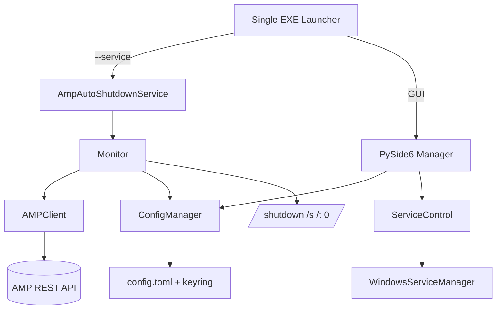

# AMP Auto Shutdown

[](https://github.com/your-org/amp-auto-shutdown/actions/workflows/ci.yml)
[](LICENSE)

AMP Auto Shutdown bundles a Windows service and desktop manager that monitor CubeCoders AMP game-server instances. When every monitored instance remains below its player threshold for the configured idle window, the service powers off the host. The PySide6 GUI ships in the same executable so administrators can install or remove the service, tweak shutdown rules, and review logs from one place.


## Highlights
- Windows service built with pywin32, configured for automatic start and rotating log output.
- PySide6 management GUI with connection testing, instance selection, maintenance windows, and dry-run toggle.
- AMP polling through the REST API with retries, timeouts, and maintenance-window suppression to avoid surprise shutdowns.
- Secure API-key storage via Windows Credential Manager (`keyring`) when available.
- PyInstaller build script that produces a single executable containing both the service and GUI.

## Architecture


## Requirements
- Windows 11 or Windows Server 2019/2022 with desktop experience.
- AMP controller reachable over HTTPS with a valid API key.
- Python 3.11+ (only required when running from source).

## Using the Packaged EXE
1. Download `AmpAutoShutdown.exe` from the releases page.
2. Run the executable as an administrator the first time; it installs the Windows service and immediately opens the GUI.
3. Enter the AMP base URL, API key, and polling settings. Use **Test Connection** to verify connectivity.
4. Select the AMP instances to monitor, adjust per-instance thresholds, and configure optional maintenance windows.
5. Click **Save Settings**. When every monitored instance stays under its threshold for the idle delay, the service issues `shutdown /s /t 0` (unless dry-run is enabled).
6. Re-launching the executable later skips installation and simply opens the GUI. Use the GUI buttons to start, stop, or uninstall the service.

## Configuration
Persistent settings live in `%ProgramData%\AmpAutoShutdown\config.toml`. The bundled `config.example.toml` documents every option. Key fields include:
- `amp_base_url`: AMP controller base URL, for example `https://amp.local:8080`.
- `poll_interval_seconds`: Interval between AMP polls (default 30).
- `idle_delay_minutes`: Idle duration that must elapse before shutdown (default 10).
- `global_player_threshold` and `per_instance_thresholds`: Player counts above which an instance counts as active.
- `maintenance_windows`: Day/time ranges that suppress shutdown.
- `dry_run`: When true, the service logs the shutdown decision but does not run the command.
- `verify_ssl`: Controls TLS certificate checking for AMP requests.

API keys are stored with Windows Credential Manager via `keyring` when available; otherwise the GUI will prompt you to save them manually each time.

## Running from Source
1. Create a virtual environment:
   ```powershell
   python -m venv .venv
   ```
2. Activate the environment (run each command separately):
   ```powershell
   .\.venv\Scripts\Activate.ps1
   ```
3. Install the project in editable mode:
   ```powershell
   pip install -e .
   ```
4. Launch the GUI:
   ```powershell
   python -m amp_autoshutdown --gui
   ```

## Building the Single EXE
```powershell
powershell -ExecutionPolicy Bypass -File scripts\build_exe.ps1
```
The script wraps the project with PyInstaller and saves `AmpAutoShutdown.exe` under `dist/`.

## Logs
Rolling logs are written to `%ProgramData%\AmpAutoShutdown\logs\amp_autoshutdown.log`. Use the GUI's **View Logs** button or open the file directly.

## Project Resources
- [CONTRIBUTING.md](CONTRIBUTING.md) explains how to propose changes.
- [CODE_OF_CONDUCT.md](CODE_OF_CONDUCT.md) describes expected community behaviour.
- [CHANGELOG.md](CHANGELOG.md) tracks feature additions and fixes.

## License
Distributed under the [MIT License](LICENSE).
